# ComfyLink

**Generate with Flux 2 from your phone. End-to-end encrypted. Your prompts stay yours.**

Run Flux 2 on your own PC's GPU and use it from any browser — phone, tablet, laptop — without exposing a single port on your home network. Your PC connects outbound to a lightweight relay; the relay forwards encrypted blobs it cannot read. No cloud subscription. No one else processing your images.

---

<table>
  <tr>
    <td align="center"><b>Queue — Current</b><br>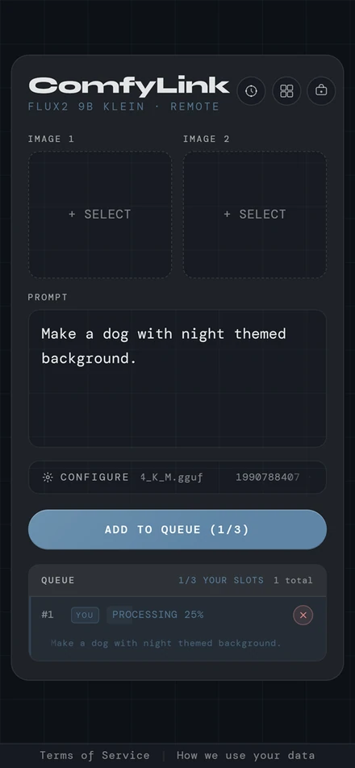</td>
    <td align="center"><b>Configuration</b><br>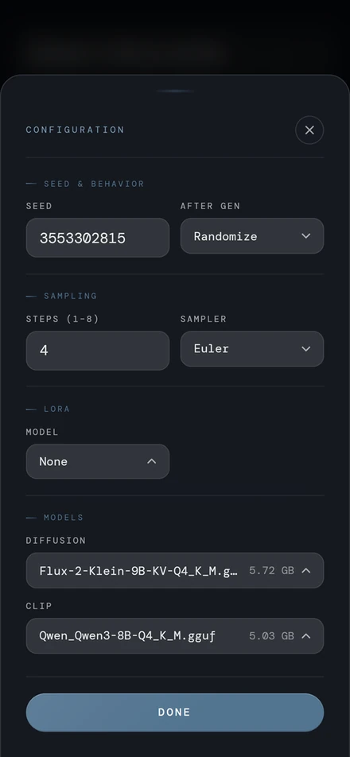</td>
    <td align="center"><b>Result Preview</b><br>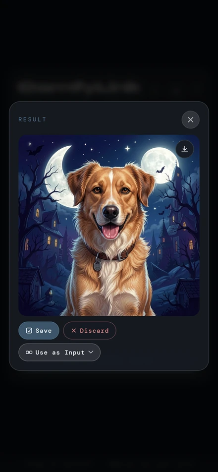</td>
  </tr>
</table>

<details>
<summary><b>Show the rest</b> — login, register, generate, vault, admin (9)</summary>

<br>

<table>
  <tr>
    <td align="center"><b>Login</b><br>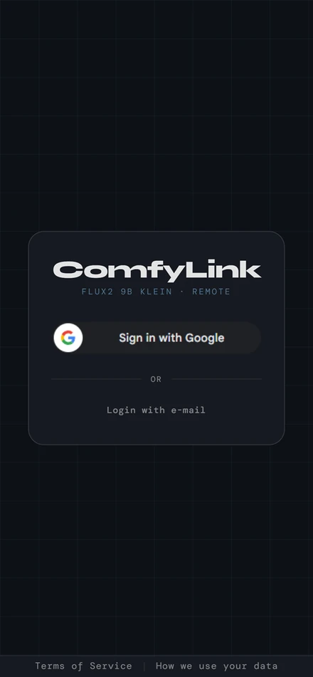</td>
    <td align="center"><b>Register</b><br>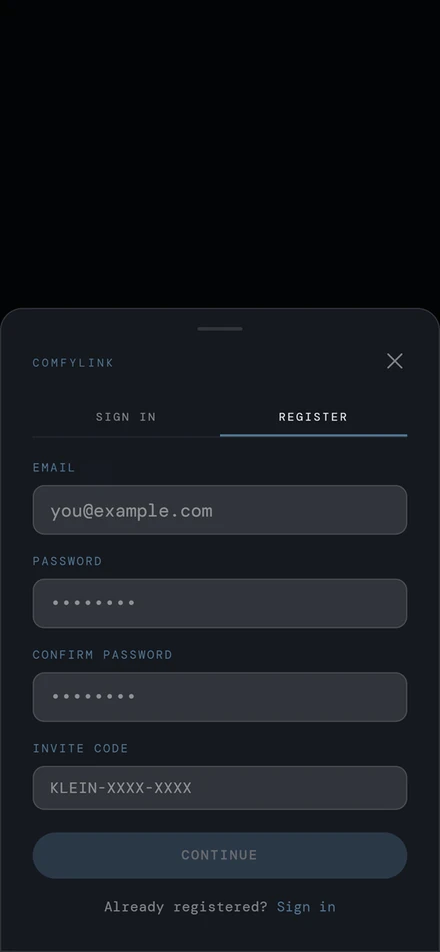</td>
    <td align="center"><b>Generate</b><br>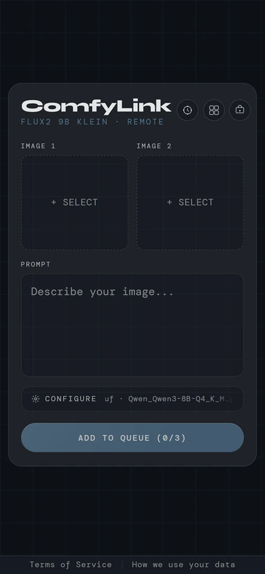</td>
  </tr>
  <tr>
    <td align="center"><b>Image Preview in Vault</b><br>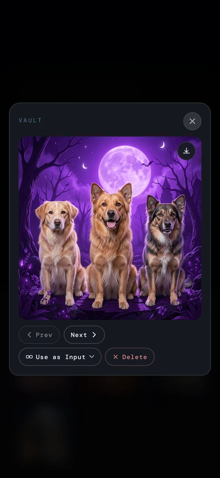</td>
    <td align="center"><b>Gallery</b><br>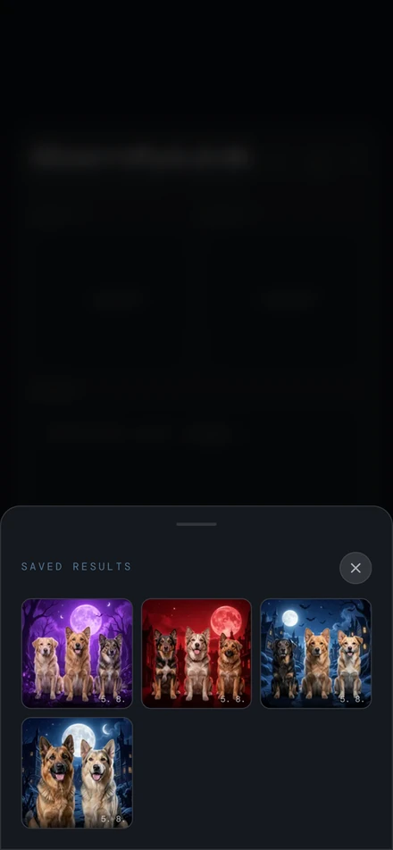</td>
    <td align="center"><b>Result Expiring + Queued</b><br>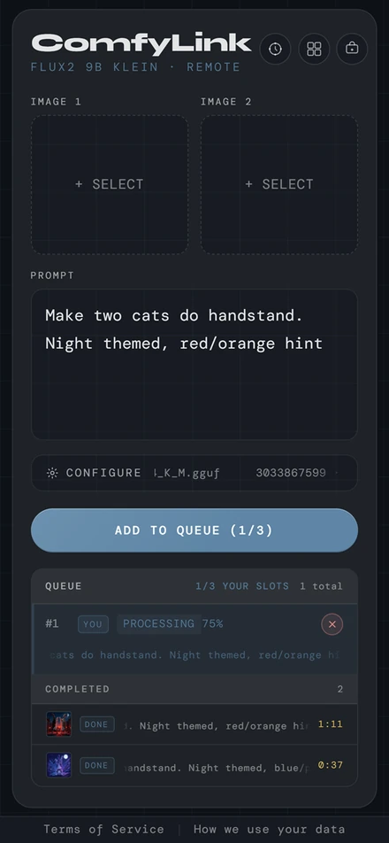</td>
  </tr>
  <tr>
    <td align="center"><b>Vault Settings</b><br>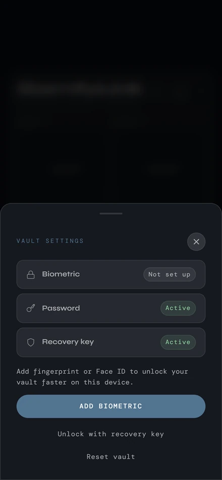</td>
    <td align="center"><b>Admin — Codes</b><br>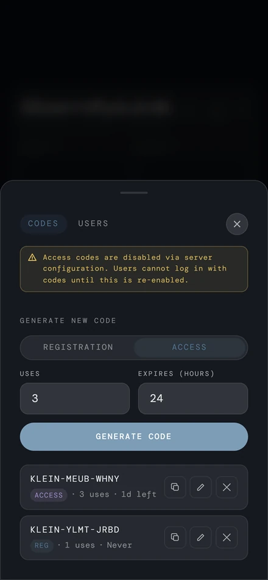</td>
    <td align="center"><b>Admin — Users</b><br>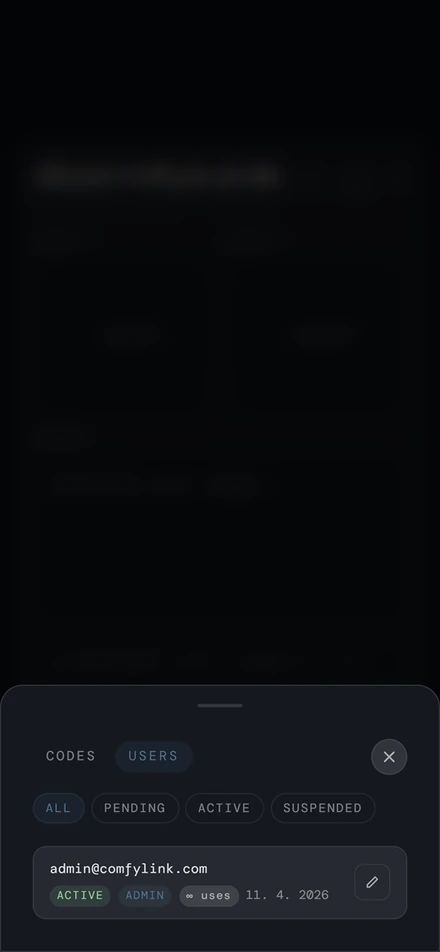</td>
  </tr>
</table>

</details>

---

## How it works

```
[Any browser] ──── WSS encrypted ────▶ [Relay server] ──── WSS encrypted ────▶ [Your PC + ComfyUI]
```

Your PC connects *outbound* to the relay — no port-forwarding, no dynamic DNS, no firewall rules needed. The relay brokers WebSocket connections between your browser and your PC; it never decrypts anything. ComfyLink is designed for personal or small-group use: you run the relay, you control who gets in.

---

## Get started

Pick the deployment that fits how you'll use it:

| | **Tier 1 — Local** | **Tier 2 — Public VPS** |
|---|---|---|
| **Where the relay runs** | On your PC | On a cheap Linux VPS |
| **Who can connect** | You + anyone on your Tailscale network | Anyone with an invite code or Google account |
| **What you need** | A Tailscale account (free) | A VPS, a domain name, Docker |
| **Setup time** | ~10 minutes | ~30 minutes |
| **Guide** | [SETUP.md](SETUP.md) | [docs/DEPLOYMENT.md](docs/DEPLOYMENT.md) |

> **Heads-up — secure context.** End-to-end encryption uses WebCrypto, which browsers only allow on `https://` or `http://localhost`. A plain LAN IP like `http://192.168.x.x` won't work for phones; that's why both tiers use a real hostname (Tailscale's MagicDNS or your own domain).

---

## Features

**Encryption.** Every job — prompt, reference images, result — is encrypted on your device with ECDH-AES-GCM and a fresh ephemeral keypair, so the relay only ever holds opaque blobs. Vault images use a master key wrapped by your passkey, password, or recovery phrase; nothing the server stores is decryptable without a key it doesn't have.

**Sign-in.** Three ways in:
- **Google** or **e-mail + password** (argon2id) — full accounts with quota tracking, vault, and gallery. Invite-only by default (`INVITE_REQUIRED=true`).
- **Access code** — paste a `KLEIN-XXXX-XXXX` code and generate. No sign-up, no account. Useful for sharing with non-technical friends.

**Generation.** Flux 2 Klein 9B GGUF with selectable quantization (Q4–Q8) and CLIP model, single- and multi-reference image-edit modes, and optional LoRA with adjustable strength.

**Administration.** Admin panel for managing users, issuing and revoking access codes, and adjusting per-user quotas. First admin is promoted via CLI.

---

## Privacy

| Data | Stored on relay? | Who can read it |
|---|---|---|
| Prompt text & reference images | No — encrypted in transit only | Only your PC decrypts |
| Generated full image | Encrypted blob (if saved to vault) | Only you, via your master key |
| Gallery thumbnails | Encrypted blob | Only you, via your master key |
| User e-mail, timestamps, quota counters | Yes, plaintext | Deployer / admin |
| ComfyUI job history | RAM only on the PC, deleted after each job | Not persisted |

- **Audit log** records IP, timestamp, job ID, and user identity for every submission — never any image or prompt content. Entries auto-delete after 6 months.
- **ComfyUI** is launched with hardening flags (`--disable-metadata`, `--database-url sqlite:///:memory:`, `--verbose CRITICAL`) to suppress prompt metadata in PNGs and avoid disk-resident history.
- **AI Act compliance**: every generated PNG carries embedded `AI_Generated: yes` metadata.

Full detail, the deployer legal position on compelled decryption, and a plaintext metadata audit → [docs/PRIVACY.md](docs/PRIVACY.md)

---

## Documentation

| Doc | Contents |
|-----|----------|
| [SETUP.md](SETUP.md) | Quick start for local (Tier 1) deployment |
| [docs/DEPLOYMENT.md](docs/DEPLOYMENT.md) | VPS deployment (Tier 2), GitHub Actions auto-deploy, manual deploy, Cloudflare proxy |
| [docs/CONFIGURATION.md](docs/CONFIGURATION.md) | All environment variables with defaults and descriptions |
| [docs/ARCHITECTURE.md](docs/ARCHITECTURE.md) | Workflow pipeline, job queue mechanics, encryption schemes, wire formats |
| [docs/AUTHENTICATION.md](docs/AUTHENTICATION.md) | Account lifecycle, per-user quotas, invite codes, guest mode |
| [docs/VAULT.md](docs/VAULT.md) | Master key wrapping (bio/password/recovery), vault operations, result storage |
| [docs/ADMIN.md](docs/ADMIN.md) | Admin panel tabs (Codes, Users), first-admin CLI |
| [docs/API.md](docs/API.md) | Full REST API and WebSocket protocol reference |
| [docs/PRIVACY.md](docs/PRIVACY.md) | Privacy chain, vault data model, deployer legal position |
| [docs/TOS.md](docs/TOS.md) | Terms of Service and legal framework |
| [ComfyUI-Workflow/README.md](ComfyUI-Workflow/README.md) | Required models, custom nodes, full node map |

---

## Repo structure

```
ComfyLink/
├── .env.example          ← copy to .env and fill in values
├── .github/workflows/    ← GitHub Actions: auto-deploy on push to main
├── Caddyfile             ← reverse proxy / TLS config
├── docker-compose.yml    ← VPS orchestration (server + Caddy)
├── client/               ← Svelte frontend (browser-facing)
├── server/               ← Node.js/Express relay + WebSocket broker
├── pc-client/            ← Python bridge: connects relay → ComfyUI
├── ComfyUI-Workflow/     ← visual workflow + model/node docs
└── docs/                 ← extended documentation
```

---

## Terms of Service

All users — Google-authenticated, e-mail/password, or access code — are subject to the Terms of Service. Full text and legal framework (Czech Civil Code, GDPR, AI Act) → [docs/TOS.md](docs/TOS.md)

---

## License

MIT — see [LICENSE](LICENSE).
